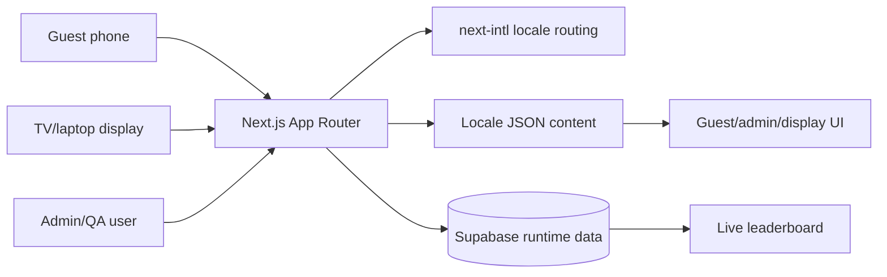

# Repository Summary

---

# 1. Executive Summary

Han Birthday Experience is a planned bilingual, mobile-first web experience for Callahan (Han)'s first birthday. The public title is "WHO IS TURNING ONE?!". Guests are expected to scan a QR code at the party, choose English or Vietnamese, enter a lightweight display name, play a short timed quiz, view results and a live leaderboard, and optionally leave a birthday message.

The project is intentionally not a generic quiz app. All major documents frame it as a warm digital extension of the birthday party, with the quiz, leaderboard, messages, gallery, and timeline serving the emotional goal of guest connection and memory preservation.

Current maturity is runnable scaffold plus visual design-system foundation. The repository contains planning documents, AI guidance, placeholder locale schemas, a Next.js App Router scaffold, project configuration, content validation, centralized birthday-theme tokens, bilingual-safe typography, reusable visual primitives, decorative motifs, reduced-motion-aware motion patterns, intentional placeholder assets, route-boundary placeholders, and localized internal design-system showcase routes. Supabase runtime behavior, feature logic, real assets, persistent event data, and deployment wiring remain future work.

The accepted target architecture is Next.js App Router, TypeScript, Tailwind CSS, shadcn/ui, Framer Motion, Supabase, next-intl, and Vercel. Milestone 1 scaffolds this stack and validates placeholder content, while state boundaries, data persistence, quiz logic, and deployment remain planned future work.

The architecture direction separates static localized content from runtime event data. Locale JSON files under `content/` are intended to hold UI copy and structured content, while Supabase is intended to own participants, quiz attempts, immutable question responses, messages, event settings, QA/test flags, and live leaderboard data.

The repository strongly protects content authenticity. Multiple documents state that no Han stories, memories, quiz facts, timeline entries, photo captions, or fake photos may be invented. Real content must come from Ian or another approved source. Current locale files intentionally contain empty strings and empty arrays as schema placeholders.

Roadmap Milestone 0: Foundation, Milestone 1: Project Scaffold, and Milestone 2: Content and Design System Foundation are completed. The next recommended milestone is guest entry and quiz MVP, followed by Supabase and leaderboard, messages/placeholders, lightweight admin/QA, and event readiness/deployment.

No functional birthday feature flow exists yet, so implementation risk is mostly future risk: preserving the documented product intent beyond scaffolding, making per-question response locking reliable, separating test and production data, completing bilingual content, and preparing for party-day device/network conditions.

Repository health for AI handoff is high at the documentation level and early at the implementation level. Another AI can run the scaffold, validate content, inspect route boundaries, review the Milestone 2 design-system showcase, and continue from Milestone 3, but cannot test real birthday feature behavior because it has not been implemented.

---

# 2. Product Summary

Product vision: create a premium, warm, bilingual birthday web experience that feels like part of Han's first birthday party and preserves memories. The product should be personal and festive, not reusable quiz SaaS.

Target users:

- Guests at the birthday party using personal mobile phones.
- Ian or a trusted host/admin checking readiness, scores, messages, leaderboard access, and QA/test separation.
- People watching a shared laptop or TV leaderboard.
- Future family viewers revisiting messages, gallery, or timeline content.

Core experience:

1. Scan QR code.
2. Choose English or Vietnamese.
3. Enter display name.
4. Play a short quiz with 20 seconds per question.
5. Submit and lock each question response as accepted or timed out.
6. See celebratory result.
7. View live leaderboard.
8. Leave birthday message.
9. Optionally view timeline/gallery placeholders or future memory content.

MVP requirements from `docs/PRD.md`: guest QR entry, language selection, display name, timed quiz, per-question immutable responses, result screen, live leaderboard, message submission, lightweight admin verification, QA/test separation, complete English/Vietnamese guest flows, and no unapproved real content.

Future plans: curated gallery, timeline, exportable messages, more quiz rounds or mini-games, private post-event family page, and possible media upload workflow if privacy and review requirements are later defined.

Key source documents: `PROJECT_CONTEXT.md`, `PROJECT_PHILOSOPHY.md`, `docs/PRD.md`, `docs/UX.md`, `ROADMAP.md`.

---

# 3. Documentation Summary

| File | Purpose | Status | Notes |
| --- | --- | --- | --- |
| `README.md` | Public project overview, workflow, target stack, doc map, non-negotiables | Good foundation | Reflects Milestone 1 scaffold status and local validation commands. |
| `PROJECT_CONTEXT.md` | One-file briefing for future contributors and AI agents | Strong | Best first read; clearly states current repo has docs, placeholder schemas, and Milestone 1 scaffold only. |
| `PROJECT_PHILOSOPHY.md` | Product, experience, design, content, technical, and decision principles | Strong | Useful guardrail against generic quiz implementation; no implementation detail. |
| `DECISIONS.md` | Accepted ADRs | Good | Contains accepted decisions including per-question immutable responses and minimal admin MVP; future schema/policy/access details remain absent. |
| `ROADMAP.md` | Milestone plan from foundation through deployment | Good | Milestone 0, Milestone 1, and Milestone 2 completed; Milestone 3 is next. |
| `AGENTS.md` | Role-based AI guidance for PM, architect, frontend, UX, art, QA | Strong | Clear role responsibilities and review checklists. |
| `.github/instructions/birthday.instructions.md` | Repository-wide AI coding/review instructions | Strong | Applies to all files; mirrors product/content/UI/architecture constraints. |
| `docs/PRD.md` | Product requirements, personas, success metrics, requirements, risks | Strong | MVP and foundation acceptance are clear; real content and admin access details are pending. |
| `docs/ARCHITECTURE.md` | Planned technical architecture | Good | Target stack, folders, routes, state, Supabase schema plan, APIs; explicitly not immediate implementation plan. |
| `docs/FOUNDATION_REVIEW.md` | Milestone 0 review record | Complete | Records applied clarifications, open decisions, and scaffold-only next milestone. |
| `docs/UX.md` | Guest/admin/display flows, screen states, interaction direction | Strong | Comprehensive screen/state planning; no wireframes or final copy. |
| `docs/UI_GUIDELINES.md` | Visual system direction | Good | Includes Milestone 2 token, typography, primitive, motif, and motion implementation notes. |
| `docs/CONTENT.md` | Content model and validation rules | Good | Defines locale, quiz, message, timeline, gallery, asset models; no real content. |
| `docs/ASSETS.md` | Asset categories, naming, replacement, fallback rules | Good | Includes Milestone 2 placeholder component behavior; no real Han assets yet. |
| `docs/QA.md` | QA strategy, environments, test layers, release checklist | Good | Includes Milestone 2 visual check targets; feature test tooling remains future work. |
| `content/en.json` | English placeholder content schema | Partial | Shape exists; strings, questions, timeline, gallery, assets are empty. |
| `content/vi.json` | Vietnamese placeholder content schema | Partial | Shape matches English except locale value; strings, questions, timeline, gallery, assets are empty. |
| `content/scaffold.json` | Temporary scaffold route copy | Temporary | Holds diagnostic placeholder route text only; not real Han content. |

---

# 4. Architecture Summary

Current folder structure:

```text
.
  .github/instructions/birthday.instructions.md
  AGENTS.md
  DECISIONS.md
  PROJECT_CONTEXT.md
  PROJECT_PHILOSOPHY.md
  README.md
  ROADMAP.md
  content/
    en.json
    scaffold.json
    vi.json
  docs/
    ARCHITECTURE.md
    ASSETS.md
    CONTENT.md
    FOUNDATION_REVIEW.md
    PRD.md
    QA.md
    UI_GUIDELINES.md
    UX.md
  app/
    [locale]/
    display/
  components/
    motion/
    ui/
  i18n/
  lib/
    assets/
    content/
    i18n/
  public/
    assets/placeholders/
  scripts/
```

Planned architecture:



Routing is partially scaffolded. Guest locale roots live at `/en` and `/vi`; display route boundary exists at `/display/leaderboard`; admin route boundaries exist at `/{locale}/admin`; QA route boundaries exist at `/{locale}/qa`. Quiz, result, mobile leaderboard, message, timeline, and gallery feature routes remain future work.

State management is planned to stay simple. Client state will cover current question, the active selected answer before submission, timer, loading/submitting/error UI. Server/runtime state will cover participant identity, quiz attempts, immutable question responses, scores, messages, and QA/test flags.

Data flow is planned as: static localized content from `content/*.json`; runtime event data in Supabase; UI components should not hardcode content. Mutations should validate input and enforce per-question duplicate prevention server-side.

Localization is core scope. English and Vietnamese must have equivalent structure and content coverage. Missing guest-facing translations should block production.

Supabase is selected for participants, quiz attempts, question responses, messages, event settings, real-time leaderboard updates, and QA/test separation. No migrations, policies, clients, or env variables exist yet.

APIs are planned as server actions or route handlers for participant creation/resume, quiz start, question response submission, timeout locking, quiz completion, result fetch, leaderboard fetch, message submit, lightweight admin fetches/resets, and QA reset. None exist yet.

Deployment is planned for Vercel plus Supabase. No Vercel config, env example, deployment workflow, or production URL exists in the repository.

---

# 5. Feature Matrix

| Feature | Status | Notes |
| --- | --- | --- |
| Documentation foundation | Completed | Foundation docs exist, alignment clarifications are applied, and Milestone 0 is marked complete. |
| AI role/instruction system | Completed | `AGENTS.md` and `.github/instructions/birthday.instructions.md` are present and detailed. |
| Target stack decision | Completed | Accepted in `DECISIONS.md`; Milestone 1 scaffold uses the approved stack. |
| Visual design system foundation | Completed | Milestone 2 tokens, typography, primitives, motifs, placeholders, motion patterns, and showcase route exist. |
| Locale schema files | Partial | English and Vietnamese schemas exist and match; actual strings/content absent. |
| Content authenticity rules | Completed | Repeated across docs and metadata. |
| Next.js app scaffold | Completed | App Router, TypeScript, Tailwind, next-intl, shadcn config, Framer Motion primitive, Supabase dependency, and validation scripts exist. |
| Guest welcome/language flow | Planned | Specified in PRD/UX/architecture only. |
| Guest display name entry | Planned | Specified only. |
| Timed quiz | Planned | 20-second timer and single-choice model specified; no implementation or questions. |
| Per-question response locking | Planned | Accepted answer and timeout locking are documented; no server constraints yet. |
| Result screen | Planned | UX specified only. |
| Mobile leaderboard | Planned | UX and route specified only. |
| TV/display leaderboard | Planned | Dedicated route planned; no implementation. |
| Message submission | Planned | Data model and UX specified; no persistence. |
| Timeline placeholder | Planned | Content model and UX specified; no screen. |
| Gallery placeholder | Planned | Content model and UX specified; no screen/assets. |
| Lightweight admin utility | Planned | Minimal score/message/leaderboard/QA support only. |
| QA/test mode | Planned | Requirements only; no tooling. |
| Supabase schema | Planned | Table plan exists; no migrations or policies. |
| Real-time updates | Planned | Supabase realtime or polling fallback discussed; not built. |
| Tests | Partial | Content validation, typecheck, lint, build, and Milestone 2 browser screenshot checks exist as process; feature tests/tooling remain future work. |
| Deployment | Missing | Vercel/Supabase planned; no config. |
| Assets | Partial | Asset plan, placeholder SVG, and reusable placeholder component exist; real assets are absent. |

---

# 6. Screen Summary

| Screen | Purpose | Implementation Status | Missing Work |
| --- | --- | --- | --- |
| QR Entry / Welcome | Orient guests and start experience | Planned | Route, UI, localized copy, assets, loading/error states. |
| Language Selection | Choose English or Vietnamese | Planned | Locale routing, selector, persistence, fallback behavior. |
| Guest Name Entry | Collect display name for leaderboard/submissions | Planned | Form, validation, duplicate recovery, participant persistence. |
| Quiz Start | Explain timed quiz before first question | Planned | Copy, ready state, quiz session setup. |
| Quiz Question | Show one timed question with answer options | Planned | Timer, option UI, transitions, expiration, network states, content. |
| Quiz Completion | Complete after all responses are locked | Planned | Completion mutation, scoring from locked responses, recovery. |
| Result Screen | Celebrate completion and route to next actions | Planned | Score retrieval, celebratory UI, actions. |
| Leaderboard Display | TV/laptop live ranked results | Planned | Display route, data subscription/polling, empty/few/active states. |
| Mobile Leaderboard View | Let guests see rankings on phones | Planned | Mobile layout, current guest highlight, navigation. |
| Leave A Message | Collect birthday message | Planned | Form, constraints, persistence, success/error states. |
| Timeline Placeholder | Reserve future memory timeline space | Planned | Route/screen, honest empty state, future content rendering. |
| Gallery Placeholder | Reserve future photo gallery space | Planned | Route/screen, placeholders, asset fallback. |
| Lightweight Admin | Check scores/messages/leaderboard/readiness | Planned | Auth/access, minimal views, QA/test separation, necessary test resets. |
| Admin Messages | View submitted birthday messages | Planned | Simple list/table; complex review workflows deferred. |
| Admin Scores | View final quiz scores | Planned | Data view, QA/test separation, reset policy. |
| QA Mode | Safely test flows without event data pollution | Planned | QA routes, visible QA labeling, test flags, reset path. |

---

# 7. Component Summary

Milestone 2 reusable visual primitives now exist:

- `components/design/page-shell.tsx`
- `components/design/paper-panel.tsx`
- `components/design/decorative-heading.tsx`
- `components/design/birthday-badge.tsx`
- `components/design/asset-placeholder.tsx`
- `components/design/loading-treatment.tsx`
- `components/design/party-motifs.tsx`
- `components/ui/button.tsx`
- `components/motion/soft-entrance.tsx`
- `components/motion/motion-patterns.tsx`

Planned future feature components from `docs/ARCHITECTURE.md` and `docs/UX.md` are:

- Design primitives: tokens, shadcn/ui primitives, layout primitives, motion primitives.
- Locale/navigation: language selector and route-aware controls.
- Guest identity: guest name form with validation and duplicate/recovery messaging.
- Quiz: quiz shell, timer, question card, answer option, flow controller, result summary.
- Leaderboard: mobile leaderboard list and separate TV/display leaderboard table/list with stable row layout.
- Message: message form, submission confirmation, error/retry states.
- Content/asset states: empty state, asset placeholder, missing asset fallback.
- Admin/QA: lightweight utility surfaces, score/message views, QA/test mode controls.

Component rules: content must come from locale JSON or Supabase, layouts must support mobile and Vietnamese text, guest/admin/display/QA concerns must stay separated, and visuals should follow the warm cream/blue/yellow/orange paper-cut birthday direction.

---

# 8. Data Model Summary

Database: no database implementation exists. Supabase is planned for runtime event data. Planned tables are `participants`, `quiz_attempts`, `question_responses`, `messages`, and `event_settings`. Important planned fields include locale, display name, score, response submitted/locked timestamps, message status, and `is_test` flags.

JSON content: `content/en.json` and `content/vi.json` exist as placeholder schemas. Both include `schemaVersion`, `locale`, `metadata`, `navigation`, `screens`, `quiz`, `timeline`, `gallery`, `messages`, `assets`, and `admin`. All guest/admin strings are empty. Quiz questions, timeline entries, gallery items, and assets are empty arrays. `content/scaffold.json` holds temporary diagnostic route-placeholder copy for the runnable scaffold.

Translations: English and Vietnamese structures currently match except for `locale`. Translation completeness is zero for real copy. Docs require missing guest-facing translations to block production.

Assets: one placeholder SVG exists under `public/assets/placeholders/`, and `AssetPlaceholder` provides stable square, portrait, landscape, and wide fallback frames. Real assets do not exist. `docs/ASSETS.md` plans future directories under `public/assets/` and possible Supabase Storage for production media. Content files are expected to reference assets by id when approved assets are added.

Runtime state: planned but absent. Client runtime state should hold quiz progress/timer/UI states. Server/runtime state should hold participants, attempts, immutable question responses, scores, messages, and QA/test tagging.

Validation: Milestone 1 includes content schema validation and locale key parity checks. Quiz correctness validation and database/server enforcement for one accepted question response per attempt per question remain future work.

---

# 9. AI Documentation Summary

`PROJECT_CONTEXT.md` is the canonical first-read. It compresses product purpose, audience, design direction, target stack, constraints, decision priority, and current repository state.

`PROJECT_PHILOSOPHY.md` defines the enduring principles: preserve memories, reduce software friction, support bilingual hospitality, avoid fake content, and prioritize event reliability.

`AGENTS.md` assigns future AI work into roles: Product Manager, Software Architect, Frontend Lead, UX Designer, Art Director, and QA Lead. Each role points to the docs it owns and supplies review checklists.

`.github/instructions/birthday.instructions.md` is the repo-wide operational instruction file for AI coding/review tools. It requires reading `PROJECT_CONTEXT.md` and `DECISIONS.md`, using the approved stack, externalizing content, separating route concerns, enforcing per-question immutable responses server-side, tagging QA data, and following UI/UX/content rules.

`DECISIONS.md` contains accepted ADRs only. It locks in documentation-first development, the target stack, externalized content, bilingual core scope, Supabase runtime data, mobile-first guest flow with TV leaderboard, per-question immutable responses, and minimal admin MVP.

`ROADMAP.md` sequences work from completed documentation foundation through scaffold, design system, guest quiz, Supabase/leaderboard, messages/placeholders, lightweight admin/QA, and deployment. It is the best file for determining what should happen next.

`content/scaffold.json` is temporary scaffold and design-system copy for route-boundary placeholders and internal review surfaces. It is not a source for real Han content and should be reduced or replaced as real localized copy arrives in later milestones.

The docs work together as layered guidance: context explains the project, philosophy explains why, PRD/UX/UI/content/assets/architecture/QA explain what to build, ADRs record accepted constraints, roadmap orders the work, and AI instructions keep future agents aligned.

---

# 10. Current Progress

Estimated completion:

| Area | Estimate | Reasoning |
| --- | ---: | --- |
| Foundation | 100% | Core documentation, placeholder schemas, and Milestone 1 scaffold exist. |
| Product | 80% | Vision, personas, MVP, success metrics, non-goals, and risks are documented; real content is absent. |
| Architecture | 45% | Target stack and route boundaries are scaffolded; migrations, APIs, runtime state, and full feature flows remain planned. |
| Frontend | 30% | App shell, visual tokens, typography, design primitives, placeholder route pages, motifs, and motion primitives exist; feature UI is not built. |
| Backend/Supabase | 0% | Supabase is selected and schema is sketched; no migrations, policies, clients, or database config. |
| Content/Localization | 15% | Schema files exist and match; actual localized copy/questions/assets are empty. |
| Admin | 0% | Requirements only. |
| QA | 15% | QA plan and validation scripts exist; no automated feature tests, environments, or device results. |
| Deployment | 5% | Vercel-compatible Next build and env example exist; no deployed URLs or QR code. |
| Overall | 20% | Strong planning foundation and runnable scaffold, but no executable birthday feature flow yet. |

---

# 11. Technical Debt

Architectural debt:

- Runtime architecture beyond the scaffold is unverified.
- Supabase table design is descriptive only; constraints, RLS policies, indexes, and real-time strategy are undecided.
- Admin access control is explicitly deferred.
- Tie-break rules for leaderboard are not accepted unless future approval is given.
- Route protection and final URLs are not defined.

Documentation debt:

- No environment variable inventory.
- No content readiness checklist filled with real values.
- No final schema contracts or generated schema validation specs.
- No concrete asset inventory from Ian.

Implementation debt:

- No feature tests or runtime data layer yet.
- No source code for routes, components, state, APIs, Supabase, or validation.
- No tests or test runner.
- No deployment configuration.
- No real content, translations, quiz questions, images, audio, or placeholders.

---

# 12. Risks

- Late real content can compress translation, content QA, and quiz validation time.
- Current locale files are empty, so app scaffolding could accidentally ship missing text unless validation is added.
- Per-question response locking is central but not yet backed by database constraints or idempotent mutation design.
- QA/test data separation is required but not yet implemented.
- Admin route access control is unspecified.
- Supabase realtime versus polling fallback is undecided.
- Venue mobile network quality may affect guest submissions and leaderboard freshness.
- TV leaderboard legibility has been checked at 1366 x 768, but not yet on the actual target display.
- No real assets exist, so future content work still needs approved photos/illustrations and asset QA.
- No deployment/env documentation exists, so Vercel/Supabase setup may become a late blocker.

---

# 13. Missing Pieces

Critical:

- Next.js project scaffold with approved stack.
- Locale routing and content loading.
- Real bilingual UI copy and approved quiz content from Ian.
- Quiz flow with 20-second timer, scoring, per-question locking, and safe retry enforcement.
- Supabase schema, migrations, RLS/access rules, and runtime client/server integration.
- Live leaderboard route for mobile and TV/display.
- Message submission and persistence.
- QA/test data tagging and production filtering.
- Admin access strategy.
- Production deployment and QR-code-ready URL.

Important:

- Content schema validation and locale parity checks.
- Design tokens, typography choices, and shadcn/ui setup.
- Placeholder asset system and approved placeholder visuals.
- Error, loading, empty, duplicate, offline/poor-network states.
- Tests for scoring, timer, question-response duplicate prevention, locale parity, leaderboard ranking, and message submission.
- Preview environment and device testing.
- Environment variable documentation.
- Release/rollback or disable plan.

Nice to Have:

- Timeline placeholder screen if not included in MVP path.
- Gallery placeholder screen if not included in MVP path.
- Sound effects with mute/respectful browser behavior.
- Message export.
- Post-event memory archive.
- Additional mini-games or quiz rounds.

---

# 14. AI Handover

Start with `PROJECT_CONTEXT.md`, then read `DECISIONS.md`, `ROADMAP.md`, and the relevant `docs/` file for the task. The repository now has a runnable Milestone 1 scaffold, but do not assume any birthday feature flow exists.

The product is a birthday-party experience for Han, not a reusable trivia platform. Every decision should prioritize user experience, emotional experience, maintainability, then developer convenience. The visual direction is warm cream, blue/yellow/orange accents, rounded paper-cut layers, tasteful cow-party details, and premium children's party energy.

Never invent Han content. Do not create fake stories, milestones, facts, quiz answers, photos, captions, or memories. Real content must come from Ian or an approved source. Current `content/en.json` and `content/vi.json` are schemas only: empty strings, empty question arrays, empty gallery/timeline/assets. `content/scaffold.json` is temporary route-placeholder copy only.

Accepted stack: Next.js App Router, TypeScript, Tailwind CSS, shadcn/ui, Framer Motion, Supabase, next-intl, Vercel. Changing this requires a new ADR.

Planned route groups: guest routes under `/{locale}`, display leaderboard under `/display/leaderboard`, admin under `/{locale}/admin`, QA under `/{locale}/qa`. Guest, admin, QA, and display concerns must remain separated.

Planned runtime data belongs in Supabase: participants, quiz attempts, immutable question responses, messages, event settings, and `is_test` flags. Static content belongs in locale JSON. UI components must not hardcode copy or content.

MVP guest path: QR entry/welcome, language selection, display name, quiz start, timed questions with per-question locked responses, result, leaderboard, message. Leaderboard should update live or with a lightweight fallback and filter QA/test data. There is no editable final quiz answer review.

Before implementation, resolve or create the scaffold. There is no `package.json`, app directory, components, Supabase config, env example, tests, scripts, assets, or deployment config. All implementation status is planned unless a future commit adds code.

When adding code later, preserve documented constraints: mobile-first, bilingual parity, content validation, server-side question-response duplicate prevention, QA data isolation, warm error states, no generic SaaS visual language, no nested card-heavy UI, no fake memories.

Current next step after this review is Milestone 1: scaffold the project with the approved stack and wire placeholder locale files without feature logic. Do not jump to real features unless Ian explicitly reprioritizes.

---

# 15. Repository Health Score

| Category | Score | Explanation |
| --- | ---: | --- |
| Documentation | 9/10 | Comprehensive product, UX, UI, content, architecture, QA, AI, roadmap, and foundation review docs exist. Env details, final schemas, and real content inventories are still future work. |
| Architecture | 6/10 | Target architecture is coherent and documented, but unimplemented and unvalidated. Supabase policies, route protection, and concrete API boundaries remain open. |
| Maintainability | 6/10 | Principles favor separation and reviewability. Actual maintainability cannot be proven without code, tests, schemas, or tooling. |
| AI Readiness | 9/10 | Excellent AI context, role guidance, instruction file, ADRs, and explicit non-negotiables. This summary further improves handoff. |
| Code Quality | 7/10 | Milestone 1 scaffold typechecks, lints, validates content, and builds; feature logic is not present yet. |
| Consistency | 9/10 | Documents agree on documentation-first, no invented content, bilingual core, approved stack, per-question response locking, and minimal admin scope. |
| Overall | 6.5/10 | Strong planning repository and runnable scaffold, but no birthday feature flow, backend runtime, tests, real assets, or deployment yet. |
