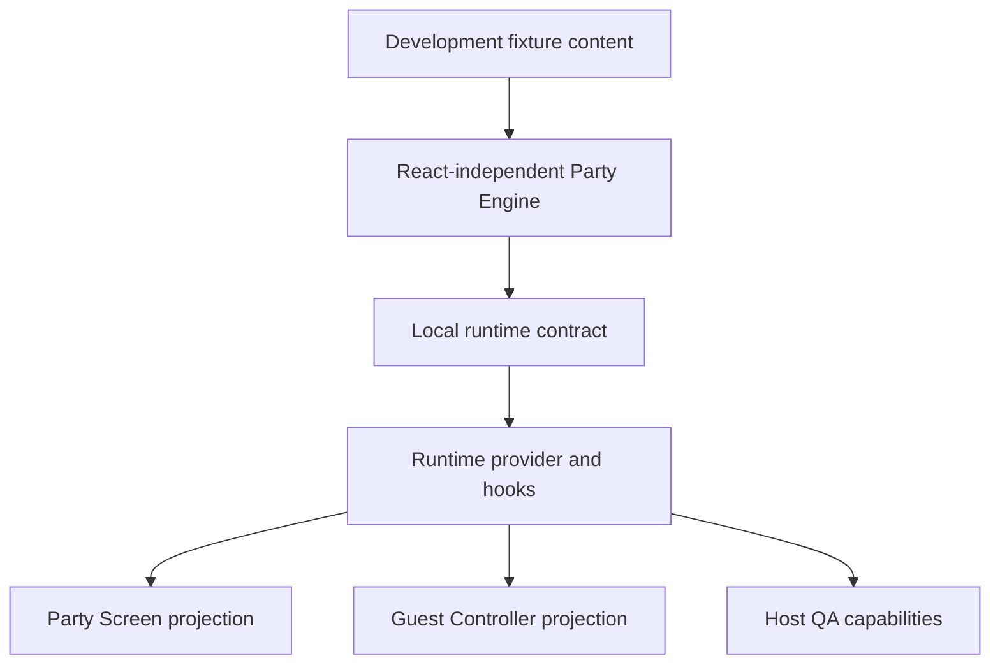
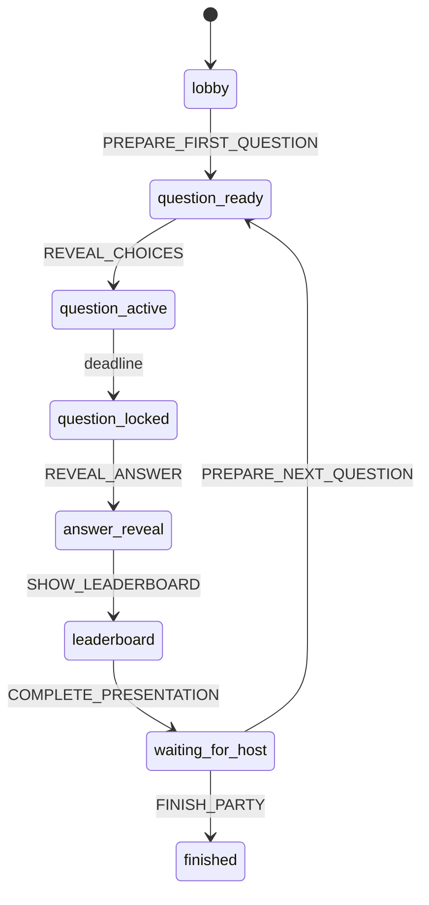

# Architecture Plan

This document describes the intended architecture. It is not an implementation plan to execute immediately.

## Target Stack

- Next.js App Router.
- TypeScript.
- Tailwind CSS.
- shadcn/ui.
- Framer Motion.
- Supabase.
- next-intl.
- Vercel.

## Architecture Principles

- Separate content, runtime data, and presentation.
- Keep guest flows mobile-first and low-latency.
- Keep phone routes optimized as personal guest controllers.
- Keep display routes optimized as the shared Party Screen for the room, not only as a leaderboard.
- Keep admin and QA routes isolated from guest routes.
- Treat localization and content validation as core architecture.
- Avoid hardcoded Han content in components.

## Product Surface Responsibilities

Milestone 3.6 aligns the architecture around two simultaneous surfaces:

- Phone: personal controller for QR entry, language selection, display name, answering active questions, submitting answers, viewing personal progress, viewing personal result, and choosing personal next actions.
- Desktop/laptop/TV: shared Party Screen for lobby, QR code, join instructions, guest count, active question, countdown, submitted-answer progress, answer reveal, Han fun fact, leaderboard, final celebration, and thank-you.

The phone must not become a second presentation screen. It should only display information useful to the current guest.

The birthday game is host-driven. Ian controls phase transitions such as Start Game, Reveal Answers, Reveal Correct Answer, Show Leaderboard, and Next Question. The question preview does not start the timer; revealing choices starts the automatic 20-second countdown, and deadline expiry closes answering without a required host lock.

Milestone 3.6 originally documented this surface model before runtime work. Milestone 4 implemented the local Party Engine and Milestone 5 implemented the Supabase-backed remote runtime, realtime wake-up model, server route boundaries, and production Host Controller.

## Shared Game Lifecycle

Future runtime work should use explicit phase semantics:

- `LOBBY`: Party Screen shows hero artwork, QR code, join instructions, guest count, and future countdown-until-start support.
- `QUESTION_PREVIEW`: Party Screen and phones show the large question while answer choices remain hidden and the timer has not started.
- `QUESTION_ACTIVE`: Party Screen shows the large question, revealed answer choices, automatic countdown, progress, and submitted-answer count while phones collect guest answers.
- `QUESTION_LOCKED`: Answering is closed automatically at the deadline; phones show personal locked or timed-out state while the Party Screen waits for host reveal.
- `ANSWER_REVEAL`: Party Screen reveals the correct answer, celebration, and approved Han fun fact.
- `LEADERBOARD`: Party Screen shows animated rankings and current positions.
- `NEXT_QUESTION`: Host advances the room toward the next question.
- `FINISHED`: Party Screen shows final leaderboard, celebration, and thank-you.

## Planned Folder Structure

Future implementation may use a structure like:

```text
app/
  [locale]/
    (guest)/
      page.tsx
      quiz/
      result/
      leaderboard/
      message/
      timeline/
      gallery/
    admin/
    qa/
    design-system/
  display/
    party/
    leaderboard/ # legacy placeholder or redirect candidate until the Party Screen route is built
components/
  design/
  motion/
  ui/
  layout/
  guest/
  quiz/
  leaderboard/
  message/
  admin/
content/
  en.json
  vi.json
lib/
  content/
  i18n/
  supabase/
  quiz/
  validation/
styles/
  globals.css
```

The exact structure started in Milestone 1 and Milestone 2. Feature folders should still be introduced only as their milestones begin.

## Routing Plan

Current and planned guest routes:

- `/{locale}`: welcome and entry.
- `/{locale}/play`: implemented phone Guest Controller route for local or remote runtime.
- `/{locale}/quiz`: older planned quiz-flow route; current implementation uses `/{locale}/play`.
- `/{locale}/result`: planned result screen if separated from the controller.
- `/{locale}/leaderboard`: planned mobile leaderboard.
- `/{locale}/message`: planned leave-a-birthday-message route.
- `/{locale}/timeline`: planned placeholder or future timeline.
- `/{locale}/gallery`: planned placeholder or future gallery.

Display routes:

- `/display/party`: planned shared Party Screen route for lobby, questions, reveal, fun fact, leaderboard, and finished states.
- `/display/leaderboard`: existing placeholder path from earlier milestones. After Milestone 3.6 it should be treated as a legacy compatibility path or redirect candidate, not as the final product responsibility.

Internal review routes:

- `/{locale}/design-system`: development-facing visual foundation showcase. It demonstrates tokens, typography, controls, panels, placeholders, motifs, loading treatment, motion, and bilingual text expansion. It is not a production guest flow.

Admin routes:

- `/{locale}/admin`: lightweight admin utility for scores, messages, Party Screen link/status, QA/test separation, and simple resets.

QA routes:

- `/{locale}/qa`: QA mode entry.
- `/{locale}/qa/party`: implemented local Party Engine harness with host controls, display preview, and guest preview.
- `/{locale}/qa/quiz`: older planned test quiz route; current implementation uses `/{locale}/qa/party`.

Route protection and final URLs should be decided during implementation planning.

## Component Hierarchy

Base layer:

- Design tokens.
- shadcn/ui primitives.
- Layout primitives.
- Motion primitives.

Milestone 2 implemented base layer:

- Central tokens in `app/globals.css` and Tailwind mappings in `tailwind.config.ts`.
- Typography loaded in `app/layout.tsx` through `next/font/google`.
- Design primitives in `components/design/`.
- Motion primitives in `components/motion/`.
- Internal design-system route at `/{locale}/design-system` for visual review.
- Guest, display, admin, and QA route boundaries remain placeholders and do not perform runtime data actions.

Milestone 3 implemented guest onboarding components in `components/guest/`:

- `OnboardingFlow` owns the welcome-to-ready client flow.
- `OnboardingHero`, `LanguageSelector`, `GuestNameCard`, `InstructionCard`, `ProgressIndicator`, and `CelebrationBanner` compose the onboarding screens.
- The localized guest root `/{locale}` now renders onboarding instead of the scaffold placeholder.
- Display, admin, QA, and design-system routes remain separate from guest onboarding.

Milestone 3.5 refined the guest onboarding presentation without changing route or runtime state boundaries:

- `components/design/title-lockup.tsx` owns the public title treatment.
- `components/design/hero-photo-frame.tsx` owns the primary future Han photo frame and fallback behavior.
- `components/design/party-motifs.tsx` includes additional reusable decorative motifs for the richer party scene.
- Existing `components/guest/` screens were visually recomposed while preserving the same session-only transitions and quiz placeholder boundary.

Milestone 3.6 aligned planned surface responsibilities without adding runtime behavior:

- Phones are documented as personal controllers.
- Desktop/laptop/TV is documented as the shared Party Screen.
- `/display/party` is the planned future Party Screen route.
- `/display/leaderboard` remains an existing legacy placeholder or redirect candidate.
- Host-driven phase transitions and shared lifecycle terms are documented for future implementation.

Milestone 4 implemented the local Party Engine foundation:

- `lib/party-engine/` owns the React-independent domain model, typed phases, commands, reducer, selectors, fixture loading, clock abstraction, and tests.
- `lib/party-runtime/` owns the local runtime contract, in-memory adapter, runtime provider, hooks, and localized development UI copy loader.
- `components/party/` owns the Party Screen, Guest Controller, Host QA controls, and QA simulation harness.
- `/display/party` is the primary shared Party Screen route.
- `/display/leaderboard` redirects to `/display/party`.
- `/{locale}/play` is the phone Guest Controller route.
- `/{locale}/qa/party` renders local host controls, Party Screen preview, and guest controller preview from one local runtime.

The Milestone 4 runtime is local-only. It does not synchronize across browser tabs or devices, does not persist to Supabase, does not authenticate host commands, and does not make correct answers production-secret.

Milestone 5 adds the remote runtime path:

- `supabase/migrations/202607120001_milestone5_party_sessions.sql` defines `party_sessions`, `participants`, `question_responses`, `host_command_log`, indexes, constraints, RLS policies, and `touch_party_session_response`.
- `lib/party-remote/repository.ts` maps Supabase rows to `PartyState`, runs Party Engine commands on the server, persists accepted snapshots, and builds surface projections.
- `app/api/party/session`, `app/api/party/join`, `app/api/party/response`, `app/api/party/host/login`, `app/api/party/host/status`, and `app/api/party/host/command` are the production server boundaries.
- `/{locale}/host` is the production Host Controller. `/{locale}/qa/party` remains the local developer harness.
- `/display/party` and `/{locale}/play` choose the remote runtime when Supabase server env is configured and preserve the local Milestone 4 runtime when env is absent.
- Browser clients use remote snapshots plus Supabase realtime wake-up subscriptions and periodic resync. They do not directly update authoritative tables.

The current party-session selector, lifecycle semantics, environment isolation, idempotency model, and host runbook are defined in [PARTY_SESSION_ARCHITECTURE.md](PARTY_SESSION_ARCHITECTURE.md). That document supersedes earlier Milestone 5 wording that treated `PARTY_SESSION_IS_TEST` as a default session selector.

Domain components:

- Language selector.
- Guest name form.
- Quiz shell.
- Timer.
- Question card.
- Answer option.
- Result summary.
- Leaderboard table/list.
- Message form.
- Empty state.
- Asset placeholder.

Feature compositions:

- Welcome screen.
- Quiz flow controller.
- Result page.
- Mobile leaderboard page.
- Shared Party Screen page.
- Lightweight admin utility.
- QA utility.

## State Management

Use the simplest state model that supports reliability.

Client state:

- Current question index.
- Selected answer for the active question before submission.
- Timer state.
- Local UI state such as loading, submitting, and errors.

Shared game state, once implemented:

- Current phase from the shared lifecycle.
- Current question index.
- Opened-at and locked-at timing metadata.
- Submitted-answer count for the active question.
- Reveal/fun-fact visibility state controlled by the host.
- Leaderboard visibility state.

Milestone 3 client/session state:

- Selected language.
- Guest display name.
- Current onboarding step.

This state is stored in browser `sessionStorage` only. It does not create participant IDs, Supabase records, quiz attempts, question responses, leaderboard entries, messages, admin records, or QA/test data.

Milestone 4 local party state:

- `PartyState.phase` is the single authoritative lifecycle phase.
- Allowed phases are `lobby`, `question_ready`, `question_active`, `question_locked`, `answer_reveal`, `leaderboard`, `waiting_for_host`, and `finished`. Current product semantics treat `question_ready` as the preview state and `question_locked` as the deadline-closed state.
- Static question text remains in development fixtures; runtime state stores question ids and responses.
- Guest draft answer selection remains local UI state until the Submit Answer command is accepted.
- Locked responses are immutable. Exact duplicate retry returns the existing state; conflicting retry is rejected.
- Submissions are accepted only when `receivedAt < deadlineAt`.
- Timeout responses are materialized when the question locks.
- Scores are derived from locked responses only: correct equals 1, incorrect/timeout equals 0.





Server/runtime state:

- Participant identity.
- Quiz attempt.
- Immutable question responses.
- Score.
- Message submissions.
- Shared game phase and host-controlled progression once approved.
- QA/test flag.

Persistence should happen at clear boundaries so refreshes and duplicate taps do not corrupt data.

## Content Loading

- Locale JSON files provide structured copy and quiz content.
- next-intl handles locale routing and translated UI strings.
- Content schema validation should run during development/build once implementation begins.
- Missing translation keys should block production release.

## Supabase Schema

Milestone 5 implements the runtime schema in `supabase/migrations/`. The older draft list below is retained only as historical planning context for features that are not yet implemented, such as messages.

### Implemented Runtime Tables

#### `party_sessions`

Authoritative shared party snapshot: join code, party key, deployment environment, current-session flag, lifecycle status, phase, current question references, question timestamps, display locale, test metadata, monotonic revision, session label, creation idempotency key, and lifecycle timestamps.

#### `participants`

Purpose: Store guest identity for event interactions.

Fields:

- `id`.
- `party_session_id`.
- `display_name`.
- `locale`.
- `resume_token_hash`.
- `joined_at`.
- `last_seen_at`.
- `is_test`.

#### `question_responses`

Purpose: Store one immutable response for one participant/question in one party session.

Fields:

- `id`.
- `party_session_id`.
- `participant_id`.
- `question_id`.
- `selected_option_id` or null for timeout.
- `status`: `locked_answer` or `locked_timeout`.
- `submitted_at`.
- `locked_at`.
- `response_duration_ms`.
- `is_correct`.
- `submission_id`.
- `is_test`.

Constraints:

- Enforce one response per party session, participant, and question.
- Enforce timeout rows with no selected option and answer rows with a selected option.
- Enforce non-negative response duration when present.
- Enforce unique submission ids per party session and participant.
- Final score should be calculated from accepted locked question responses.

#### `host_command_log`

Compact command audit for accepted or rejected host commands. Command ids are unique within a party session.

### Planned Future Tables

### `messages`

Purpose: Store birthday messages.

Fields:

- `id`.
- `participant_id`.
- `display_name`.
- `locale`.
- `message`.
- `status`.
- `is_test`.
- `created_at`.

### `event_settings`

Purpose: Store runtime switches if needed.

Fields:

- `id`.
- `key`.
- `value`.
- `updated_at`.

Future non-game settings may live in `event_settings` or a dedicated table if needed. Shared quiz runtime state now lives in `party_sessions` plus immutable response rows.

Milestone 5 database implementation supersedes the older draft table list for quiz runtime:

### `party_sessions`

Authoritative shared party snapshot: join code, lifecycle status, phase, current question references, question timestamps, display locale, `is_test`, and monotonic `revision`.

### `participants`

One guest in one party session: display name, locale, hashed resume token, joined/last-seen timestamps, and `is_test`. Display names are not identity; opaque participant ids and server-issued resume tokens are.

### `question_responses`

Immutable accepted response rows. A unique constraint enforces one response per party session, participant, and question. Rows store selected option or timeout, submission/lock timestamps, response duration, correctness, submission id, and `is_test`.

### `host_command_log`

Compact command audit for accepted/rejected host commands. It is bounded by party size and is not full event sourcing.

The response endpoint calls `touch_party_session_response` after a new accepted response so realtime listeners can refetch counts and projections from the authoritative snapshot without exposing raw response rows to guests.

## Party Screen And Leaderboard Strategy

- The Party Screen is the primary shared display and should not be implemented as only a leaderboard table.
- Before the game, it should show hero artwork, QR code, join instructions, guest count, and future countdown-until-start support.
- During the game, it should show the active question, countdown, progress, submitted-answer count, locked state, answer reveal, and approved Han fun fact.
- During leaderboard phases, it should show animated ranking and current positions.
- At finish, it should show final leaderboard, celebration, and thank-you.
- Source leaderboard from completed quiz attempts whose question responses are locked.
- Rank by score first.
- Use completion time or time remaining only if approved as a tie-breaker.
- Filter out QA/test data in production display.
- Use Supabase real-time subscriptions or a lightweight polling fallback.

## API Structure

Implemented Milestone 5 route handlers:

- `GET /api/party/session`: returns display-safe or participant-safe snapshot based on participant cookie.
- `GET /api/party/sessions`: host-authorized current plus recent session history.
- `POST /api/party/sessions`: host-authorized create/archive session actions.
- `POST /api/party/join`: validates display name/locale, creates participant, sets `han_participant_session`.
- `POST /api/party/response`: validates participant cookie, active question, deadline, option, and uniqueness before inserting an immutable response.
- `POST /api/party/host/login`: verifies host PIN and sets `han_host_session`.
- `GET /api/party/host/status`: reports host auth configuration/session status.
- `POST /api/party/host/command`: verifies host cookie, expected revision, and Party Engine transition before persisting.

Planned future route handlers:

- Fetch result.
- Fetch standalone mobile leaderboard.
- Submit message.
- Admin fetch final quiz scores.
- Admin fetch messages.
- Admin remove/reset incorrect test record or quiz attempt when necessary.
- QA reset test data.

All mutation paths should validate input, preserve immutable locked responses, and prevent duplicate question responses.

## Admin And QA Separation

- Admin routes should not be discoverable through guest navigation.
- Admin access control must be defined before production.
- Future host controls should be minimal, direct, and separated from normal guest navigation.
- QA mode should tag all generated data with `is_test`.
- Production leaderboard and message views should exclude test data by default.

## Deployment Plan

- Vercel hosts the Next.js application.
- Supabase hosts database and real-time services.
- Environment variables are documented in `.env.example`, `README.md`, `docs/MILESTONE_5_REVIEW.md`, and `docs/DEPLOYMENT.md`.
- GitHub Actions runs `npm run validate`; manual live validation runs hosted RLS and optional realtime rehearsal.
- Normal deployments should use GitHub-driven Vercel integration. Local Vercel CLI deploys are reserved for diagnostics or approved emergency/manual fallback.
- Preview and production current sessions are isolated by `party_key + deployment_environment + is_current`; `PARTY_SESSION_IS_TEST` is metadata for rehearsal/test rows.

## Future Scalability

The expected party load is small, around 10 guests, but the architecture should still be clean enough to support:

- More guests.
- More quiz rounds.
- Post-event memory archive.
- Expanded gallery and timeline.
- Additional locales if needed.

Do not overbuild for hypothetical scale before the event-day experience is reliable.
