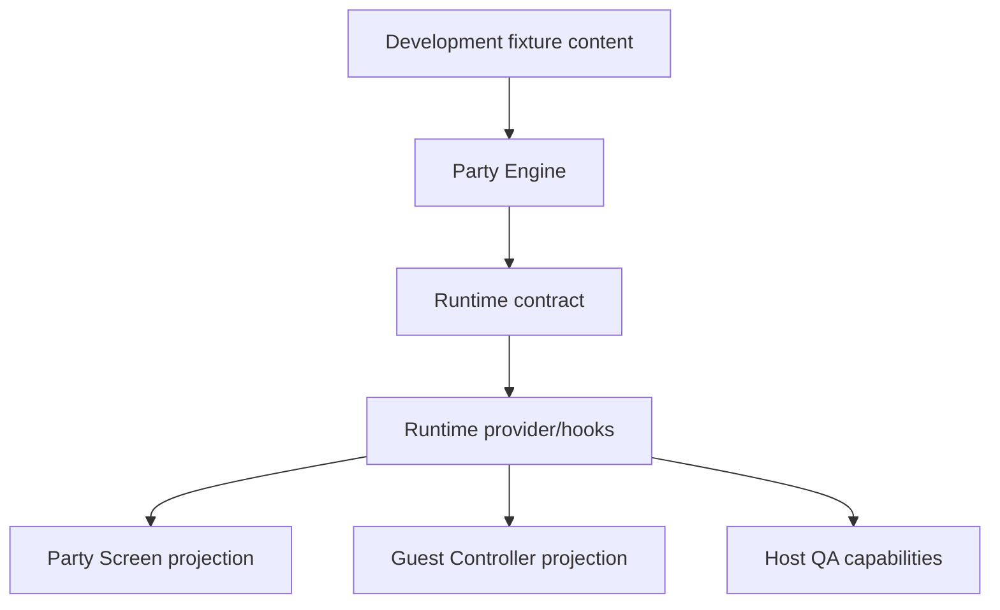

# Milestone 4 Review: Party Engine

## Scope

Milestone 4 implemented the local Party Engine foundation for Han Birthday Experience.

Implemented:

- React-independent Party Engine in `lib/party-engine/`.
- Explicit typed phase lifecycle.
- Typed host and guest commands.
- Structured domain errors.
- Timestamp-based 20-second deadline through a clock abstraction.
- Immutable per-question locked responses.
- Exact duplicate retry idempotency.
- Conflicting retry rejection.
- Timeout response materialization.
- Simple local scoring: correct = 1, incorrect/timeout = 0.
- Local runtime contract and in-memory adapter in `lib/party-runtime/`.
- Thin React provider and hooks.
- Distinct Party Screen, Guest Controller, and Host QA projections.
- `/display/party` shared Party Screen route.
- `/{locale}/play` phone Guest Controller route.
- `/{locale}/qa/party` local host/Party Screen/guest simulation harness.
- `/display/leaderboard` compatibility redirect to `/display/party`.
- Development-only bilingual fixtures and localized development UI copy.

Explicitly not implemented:

- Supabase schema, persistence, realtime, or server authority.
- Cross-device synchronization.
- Production QR generation.
- Production host authentication.
- Real Han quiz facts, memories, photos, messages, gallery, or timeline.
- Complex admin dashboard.
- Final leaderboard tie-break policy.

## Architecture



The Party Engine imports no React, Next.js pages, DOM APIs, UI components, Supabase, or route code. React surfaces consume runtime snapshots and projections only.

## State Machine

Phases:

- `lobby`
- `question_ready`
- `question_active`
- `question_locked`
- `answer_reveal`
- `leaderboard`
- `waiting_for_host`
- `finished`

Allowed transitions:

- `lobby -> question_ready`
- `question_ready -> question_active`
- `question_active -> question_locked`
- `question_locked -> answer_reveal`
- `answer_reveal -> leaderboard`
- `leaderboard -> waiting_for_host`
- `waiting_for_host -> question_ready`
- `waiting_for_host -> finished`

## Domain Invariants

- Exactly one authoritative phase exists.
- Current question ids are runtime references to static fixture content.
- No response is accepted outside `question_active`.
- Response acceptance uses `receivedAt < deadlineAt`; exact deadline submissions are rejected.
- One guest can have at most one locked response per question.
- Locked responses never change.
- Exact duplicate retry returns success without duplicate revision/score/count.
- Conflicting retry is rejected with `response_already_locked`.
- Reveal cannot occur before lock.
- Leaderboard cannot occur before reveal.
- Finished state accepts no new responses.
- Scores derive only from locked responses.
- Development fixture content is not mutated by runtime logic.

## Routes

- `/display/party`: primary shared Party Screen.
- `/display/leaderboard`: redirects to `/display/party`.
- `/{locale}/play`: guest phone controller. If no session display name exists, it shows a join-required state.
- `/{locale}/qa/party`: local QA harness with host controls, Party Screen preview, and guest controller preview.

## Timer And Race Rule

The engine stores `questionOpenedAt` and `questionDeadlineAt`. Remaining time is derived from the runtime clock. The accepted boundary rule is:

```text
receivedAt < deadlineAt
```

At exactly `deadlineAt`, a submission is rejected as `deadline_reached`. Deadline expiry locks the question exactly once in the local runtime.

## Testing

Commands run:

- `npm run validate:content` passed.
- `npm run typecheck` passed.
- `npm run lint` passed.
- `npm run test` passed.
- `npm run test:party-engine` passed: 8 tests, 8 passing.
- `npm run build` passed.
- `npm run validate` passed.
- `MILESTONE2_BASE_URL=http://localhost:3002 npm run check:visual:milestone2` passed.
- `MILESTONE3_BASE_URL=http://localhost:3002 npm run check:visual:milestone3` passed.
- `MILESTONE35_BASE_URL=http://localhost:3002 npm run check:visual:milestone3.5` passed.
- `MILESTONE4_BASE_URL=http://localhost:3002 npm run check:visual:milestone4` passed.
- `npm audit --audit-level=moderate` reported the known Next/PostCSS moderate advisory; no forced breaking downgrade was applied.

Domain tests cover:

- Valid lifecycle transitions.
- Invalid transition rejection.
- Immutable response locking.
- Exact duplicate retry idempotency.
- Conflicting retry rejection.
- Deadline boundary behavior.
- Timeout materialization.
- Simple scoring.
- Projection secrecy before reveal.
- Host capabilities.
- Manual-clock local runtime deadline scheduling.

## Screenshots

Milestone 4 screenshots are stored in `.next/milestone-4-screenshots/`.

Captured:

- Party Screen lobby.
- Guest join-required state.
- QA lobby.
- Question ready.
- Question active.
- Question locked.
- Answer reveal.
- Leaderboard.
- Waiting for host.
- Finished.
- Vietnamese active question.
- Mobile active harness.
- Reduced-motion Vietnamese active harness.

Visual review found and fixed one issue: the guest phone initially kept showing the last question after `finished`; it now renders a completion-focused state.

## Accessibility And Performance

- Guest answer options are real buttons with radio semantics and visible selected/locked states.
- Host controls are keyboard-accessible buttons with disabled states.
- Timer is visible without per-second screen-reader announcements.
- Reduced-motion screenshot path passes.
- Runtime uses one local runtime instance per browser context and one scheduled deadline per active question.
- Visual countdown updates are runtime tick notifications, not domain mutations.

## Dependency Status

`npm audit --audit-level=moderate` reports two moderate vulnerabilities from Next's transitive `postcss` dependency. The suggested fix is `npm audit fix --force`, which would install `next@9.3.3` and is a breaking downgrade. No forced remediation was applied.

## Known Limitations

- Runtime is local and in-memory only.
- Separate tabs and physical devices are not synchronized.
- Correct answers exist client-side in development fixtures.
- Host commands are not authenticated.
- Local state is not durable.
- QR is a placeholder only.
- Fixture questions are not real Han content.
- Leaderboard tie-break uses deterministic fixture order and is not final production policy.
- Messages, gallery, timeline, production admin, deployment, and Supabase are deferred.

## Deferred Work

Milestone 5 should implement shared session and realtime synchronization:

- Supabase schema and policies.
- Server-authoritative party snapshots.
- Participant joining.
- Remote command authority and acknowledgment.
- Reconnect/resume behavior.
- Cross-device synchronization.
- Production leaderboard data.
- QA/test data persistence and filtering.
- Host access strategy.

## Structured Self-Review

Product Manager: The Party Screen is now a central shared surface, phones remain personal controllers, and no real Han content was invented.

Software Architect: The engine is React-independent with explicit transitions, structured errors, clock abstraction, local runtime seam, and projection separation.

Frontend Lead: React integration is thin, routes are separated, and UI state for draft answer selection remains outside authoritative Party State.

UX Designer: Select-then-confirm is implemented, waiting/reveal/finished states are clear, and the host remains in control of major pacing.

Art Director: New screens reuse the warm paper-party visual system and remain clearly development-only where content is placeholder.

QA Lead: Domain tests, content validation, typecheck, lint, build, visual scripts, prior milestone regressions, audit, and screenshot review were completed.

## Approval Status

Milestone 4 stops at the Human Approval Gate. Do not begin Milestone 5 until Ian approves this milestone.
