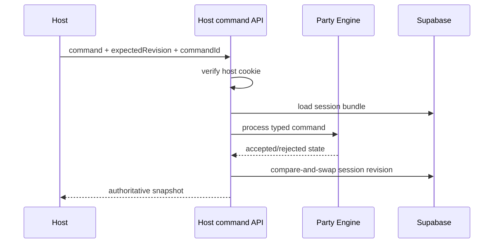
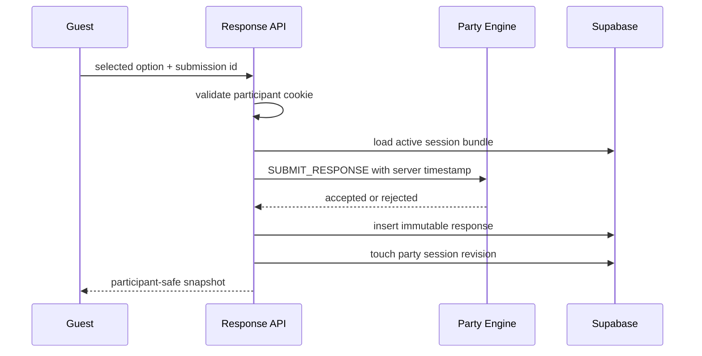
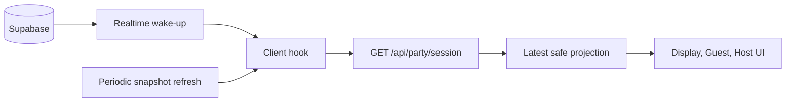
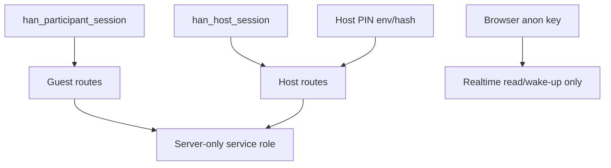
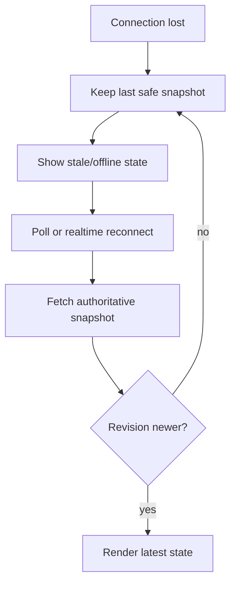

# Milestone 5 Review: Shared Session And Realtime Synchronization

## Scope

Milestone 5 implemented the Supabase-backed shared party runtime path for Han Birthday Experience.

Implemented:

- Supabase migration for party sessions, participants, immutable question responses, host command log, indexes, constraints, RLS, and response revision touch function.
- Server-authoritative session, join, response, host login, host status, and host command routes.
- Supabase row-to-Party Engine mapping layer.
- Production Host Controller at `/{locale}/host`.
- Remote-capable `/display/party` and `/{locale}/play` with local runtime fallback when Supabase env is absent.
- Generated QR lobby from active join URL.
- Participant resume cookie using opaque token plus server-side hash.
- Host PIN flow using server verification and signed HttpOnly cookie.
- Realtime wake-up plus snapshot resync model.
- QA/test tagging through `is_test`.
- Static migration checks, host auth/resume tests, and Milestone 5 visual script.

Explicitly not implemented:

- Real Han quiz content.
- Messages, gallery, timeline, media uploads, or advanced admin.
- Final production deployment.
- Live Supabase RLS/realtime proof, because credentials were not available in this environment.
- Final leaderboard tie-break decision beyond the existing deterministic created-order rule.

## Supabase Schema

Migration:

- `supabase/migrations/202607120001_milestone5_party_sessions.sql`

Tables:

- `party_sessions`: current authoritative snapshot, public join code, lifecycle status, phase, question timestamps, display locale, `is_test`, revision.
- `participants`: display name, locale, hashed resume token, join/last-seen timestamps, `is_test`.
- `question_responses`: immutable response/timeout rows with unique `(party_session_id, participant_id, question_id)`.
- `host_command_log`: compact accepted/rejected host command audit.

Function:

- `touch_party_session_response(uuid)`: increments session revision and `updated_at` after an accepted response.

## RLS Model

RLS is enabled on runtime tables. Anonymous browser clients cannot write authoritative rows. Public read access is intentionally narrow for active production session shell and participant names. Raw question responses and host command logs are not anonymous-readable. Production mutations use server route handlers with the Supabase service role key kept server-only.

## Architecture

```mermaid
flowchart TD
  Engine[Party Engine] --> Mapper[Remote mapping layer]
  Mapper --> Routes[Next.js route handlers]
  Routes --> Supabase[(Supabase Postgres)]
  Routes --> Snapshots[Safe projections]
  Snapshots --> Display[/display/party]
  Snapshots --> Guest[/{locale}/play]
  Snapshots --> Host[/{locale}/host]
  Local[Local runtime] --> QA[/{locale}/qa/party]
```

## Host Command Flow



## Guest Response Flow



## Realtime Synchronization



Realtime events are treated as wake-up signals. Clients refetch snapshots, ignore older revisions, and keep the last safe view during stale/offline states.

## Authentication And Session Boundaries



## Reconnect Flow



## Host Controller

Route:

- `/{locale}/host`

Behavior:

- PIN screen when unauthorized.
- One dominant valid next action.
- Expected revision sent with each command.
- Pending state disables duplicate taps.
- Finish Party requires confirmation.
- Connection state, phase, question, participant count, submitted count, and revision are visible.
- No QA fixture buttons, reset tools, or developer diagnostics.

## Guest Join And Resume

Guests join through `POST /api/party/join`. The server validates display name and locale, creates an opaque participant id, stores only a resume-token hash, and sets `han_participant_session`. Same browser refreshes resume the participant. Duplicate display names are allowed because display name is not identity.

## Response And Deadline Behavior

Response acceptance still uses the Party Engine rule:

```text
receivedAt < deadlineAt
```

The server supplies `receivedAt`. Late answers are rejected even if a browser countdown is visually behind. Accepted responses are immutable through both reducer logic and database uniqueness. Timeouts are materialized when a question locks.

## QR Generation

The Party Screen lobby generates a QR data URL from the active join URL at runtime. The join URL derives from `NEXT_PUBLIC_APP_URL` and the active party join code. No static production QR image is checked in.

## QA And Test Isolation

`PARTY_SESSION_IS_TEST` controls whether the auto-created session is test data. Runtime rows carry `is_test`. The local QA harness remains at `/{locale}/qa/party`; production Host Controller does not expose reset or fixture actions.

## Tests

Commands added:

- `npm run test:party-runtime`
- `npm run test:supabase`
- `npm run test:rls`
- `npm run test:realtime`
- `npm run check:visual:milestone5`

Validated in this environment:

- Host PIN hash verification.
- Signed host session cookie expiration/tamper rejection.
- Participant resume cookie parsing and token hashing.
- Migration contains required tables, constraints, indexes, RLS policies, and response revision function.

## Screenshots

Milestone 5 screenshot script writes to:

- `.next/milestone-5-screenshots/`

Matrix:

- Party Screen lobby.
- English guest controller.
- Vietnamese guest controller.
- Host PIN route.
- QA harness.

Live remote connected screenshots require Supabase env.

## Performance

Target remains about 10 guests with 20 simulated participants as rehearsal headroom. Countdown is client-derived from authoritative deadline timestamps. No one-second database timer or high-frequency server broadcast was added. Clients use one remote snapshot hook per surface, realtime wake-up subscriptions for session/participant changes, and periodic snapshot refresh.

## Security Limitations

- Host PIN is event-specific access protection, not a user account system.
- No advanced rate limiter was added for repeated PIN attempts.
- Static migration checks do not prove live Supabase RLS behavior; run live RLS tests against the configured project before event approval.
- The current runtime still uses development fixture questions, so correct answers are not production content.

## Known Risks

- Live Supabase credentials were unavailable, so remote RLS/realtime and multi-device browser flows were not rehearsed here.
- Exact duplicate response races are constrained by the database, but live concurrent retry behavior should be tested against Supabase.
- Final leaderboard tie-break remains deterministic by join order/display name and is not a final product decision.
- Preview/production QR must be validated from real phones after `NEXT_PUBLIC_APP_URL` is final.

## Deferred Work

- Real Han quiz content and production secrecy review.
- Messages, gallery, timeline, and message admin.
- Final deployment and event-day runbook.
- Full live RLS integration tests with anon/service contexts.
- Multi-device rehearsal and screenshot evidence.

## Human Approval Gate

Milestone 5 stops here for Ian review. Do not begin Milestone 6 until Ian approves the remote runtime direction and the remaining live rehearsal checklist.
