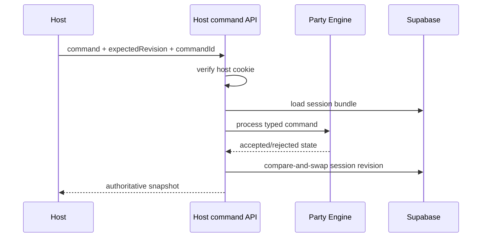
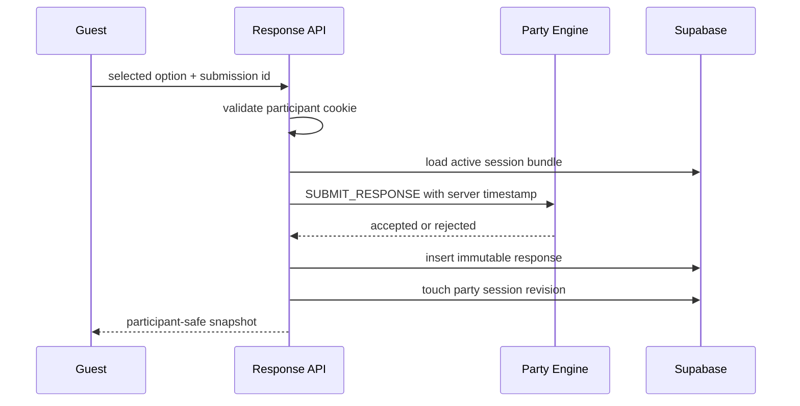
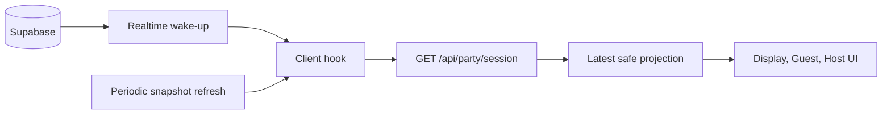
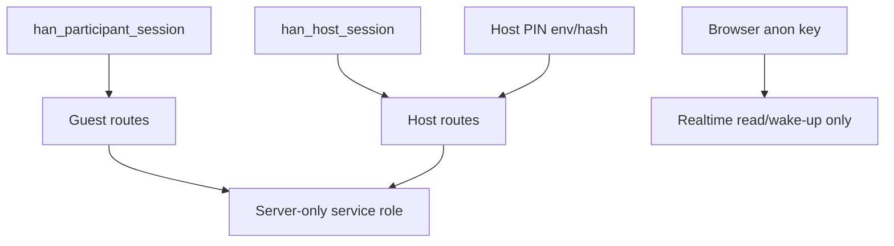
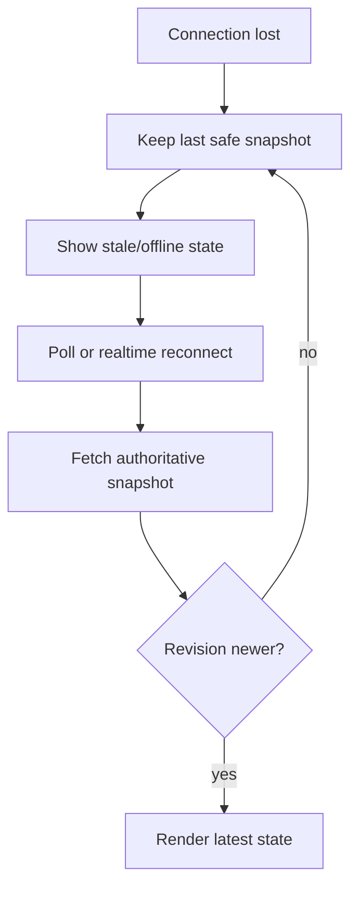

# Milestone 5 Review: Shared Session And Realtime Synchronization

## Scope

Milestone 5 implemented the Supabase-backed shared party runtime path for Han Birthday Experience.

Implemented:

- Supabase migration for party sessions, participants, immutable question responses, host command log, indexes, constraints, RLS, and response revision touch function.
- Server-authoritative session, join, response, host login, host status, and host command routes.
- Supabase row-to-Party Engine mapping layer.
- Production Host Controller at `/{locale}/host`.
- Remote-capable `/display/party` and `/{locale}/play` with local runtime fallback when Supabase env is absent.
- Generated QR lobby from active join URL.
- Participant resume cookie using opaque token plus server-side hash.
- Host PIN flow using server verification and signed HttpOnly cookie.
- Realtime wake-up plus snapshot resync model.
- QA/test tagging through `is_test`.
- Static migration checks, hosted RLS validation, hosted multi-client realtime validation, host auth/resume tests, and Milestone 5 visual script.

Explicitly not implemented:

- Real Han quiz content.
- Messages, gallery, timeline, media uploads, or advanced admin.
- Final production deployment.
- Physical laptop and two-phone rehearsal on the final event network.
- Final leaderboard tie-break decision beyond the existing deterministic created-order rule.

## Supabase Schema

Migrations:

- `supabase/migrations/202607120001_milestone5_party_sessions.sql`
- `supabase/migrations/202607130001_milestone5_security_hardening.sql`

Tables:

- `party_sessions`: current authoritative snapshot, public join code, lifecycle status, phase, question timestamps, display locale, `is_test`, revision.
- `participants`: display name, locale, hashed resume token, join/last-seen timestamps, `is_test`.
- `question_responses`: immutable response/timeout rows with unique `(party_session_id, participant_id, question_id)`.
- `host_command_log`: compact accepted/rejected host command audit.

Function:

- `touch_party_session_response(uuid)`: increments session revision and `updated_at` after an accepted response.

## RLS Model

RLS is enabled on runtime tables. Anonymous browser clients cannot write authoritative rows. Public read access is intentionally narrow for active production session shell and participant names. Raw question responses and host command logs are not anonymous-readable. Production mutations use server route handlers with the Supabase service role key kept server-only.

## Architecture

```mermaid
flowchart TD
  Engine[Party Engine] --> Mapper[Remote mapping layer]
  Mapper --> Routes[Next.js route handlers]
  Routes --> Supabase[(Supabase Postgres)]
  Routes --> Snapshots[Safe projections]
  Snapshots --> Display[/display/party]
  Snapshots --> Guest[/{locale}/play]
  Snapshots --> Host[/{locale}/host]
  Local[Local runtime] --> QA[/{locale}/qa/party]
```

## Host Command Flow



## Guest Response Flow



## Realtime Synchronization



Realtime events are treated as wake-up signals. Clients refetch snapshots, ignore older revisions, and keep the last safe view during stale/offline states.

## Authentication And Session Boundaries



## Reconnect Flow



## Host Controller

Route:

- `/{locale}/host`

Behavior:

- PIN screen when unauthorized.
- One dominant valid next action.
- Expected revision sent with each command.
- Pending state disables duplicate taps.
- Finish Party requires confirmation.
- Connection state, phase, question, participant count, submitted count, and revision are visible.
- No QA fixture buttons, reset tools, or developer diagnostics.

## Guest Join And Resume

Guests join through `POST /api/party/join`. The server validates display name and locale, creates an opaque participant id, stores only a resume-token hash, and sets `han_participant_session`. Same browser refreshes resume the participant. Duplicate display names are allowed because display name is not identity.

## Response And Deadline Behavior

Response acceptance still uses the Party Engine rule:

```text
receivedAt < deadlineAt
```

The server supplies `receivedAt`. Late answers are rejected even if a browser countdown is visually behind. Accepted responses are immutable through both reducer logic and database uniqueness. Timeouts are materialized when a question locks.

## QR Generation

The Party Screen lobby generates a QR data URL from the active join URL at runtime. The join URL derives from `NEXT_PUBLIC_APP_URL` and the active party join code. No static production QR image is checked in.

## QA And Test Isolation

`PARTY_SESSION_IS_TEST` selects the default session row used by the remote runtime. Newly created runtime rows carry that session's `is_test` value. The local QA harness remains at `/{locale}/qa/party`; production Host Controller does not expose reset or fixture actions.

## Tests

Commands added:

- `npm run test:party-runtime`
- `npm run test:supabase`
- `npm run test:rls`
- `npm run test:rls:live`
- `npm run test:realtime`
- `npm run test:realtime:live`
- `npm run vercel:push-env`
- `npm run check:visual:milestone5`

Validated in this environment:

- Host PIN hash verification.
- Signed host session cookie expiration/tamper rejection.
- Participant resume cookie parsing and token hashing.
- Migration contains required tables, constraints, indexes, RLS policies, and response revision function.
- Hosted Supabase migrations applied through `npx supabase db push`; both Milestone 5 migrations appear in the remote migration list.
- Hosted schema introspected through `npx supabase gen types typescript --linked`.
- Hosted RLS and direct REST tampering matrix passed with anon/publishable credentials for guest-equivalent evidence.
- Hosted app-backed multi-client realtime rehearsal passed with desktop display, host, English guest, Vietnamese guest, refresh recovery, late join, duplicate response control, and stale locked-response rejection.
- Vercel project `ianalysed/hanfirstbirthday` linked, preview env values pushed without printing secrets, SSO deployment protection disabled for QR access, and preview deployment validated.
- Vercel validation preview passed the multi-client realtime rehearsal against the deployed preview URL with validation-owned cleanup.

## Real Supabase Setup Runbook

Required local variables:

- `NEXT_PUBLIC_SUPABASE_URL`: hosted project API URL for browser-safe Supabase use.
- `NEXT_PUBLIC_SUPABASE_ANON_KEY`: hosted project anon/publishable key for browser realtime.
- `SUPABASE_SERVICE_ROLE_KEY`: server-only key used only by Next.js route handlers and validation setup/cleanup scripts.
- `NEXT_PUBLIC_APP_URL`: local or deployed app origin used for QR join URLs.
- `PARTY_JOIN_CODE`: public join code, defaulting to `han-turns-one`.
- `PARTY_SESSION_IS_TEST`: default session selector. Use `true` for local, Preview, and the supported Production deployment unless intentionally selecting a separate false-tagged session row.
- `HOST_PIN_HASH` or `HOST_PIN`: host unlock credential. Prefer `HOST_PIN_HASH`.
- `HOST_SESSION_SECRET`: signing secret for the HttpOnly host session cookie.

Local preflight:

```bash
npm run prepare:milestone5-env
```

This creates an ignored `.env.local` skeleton if needed, preserves existing values, fills local defaults for `NEXT_PUBLIC_APP_URL`, `PARTY_JOIN_CODE`, and `PARTY_SESSION_IS_TEST`, generates a missing `HOST_SESSION_SECRET`, and reports only `present` or `missing`.

Hosted migration process:

```bash
npx supabase login
npx supabase link --project-ref <project-ref>
npx supabase db push --dry-run
npx supabase db push
npx supabase migration list
```

Do not run hosted `supabase db reset`. Local-only resets are acceptable only against the Supabase local development stack.

After applying migrations, verify:

- `party_sessions`, `participants`, `question_responses`, and `host_command_log` exist.
- RLS is enabled on every party runtime table.
- Anonymous writes are denied for all runtime tables.
- Anonymous raw response and host command reads are denied.
- `participants.resume_token_hash` is not selectable through anon credentials.
- `party_sessions` and `participants` are members of the `supabase_realtime` publication.
- Test and production party sessions can use the same join code without sharing rows because uniqueness is scoped by `(public_join_code, is_test)`.

## Live Real-Environment Validation

Use `npm run test:rls:live` after `.env.local` is configured. The script creates rows with a `codex-m5-validation-*` prefix, proves anon-policy behavior with the browser-safe credential, prints cleanup candidate counts, and deletes only its own created sessions. Service role usage in that script is limited to credential preflight, setup, constraint checks, and cleanup; it is not accepted as RLS evidence.

The live RLS harness records a matrix with identity, credential type, operation, expected result, actual result, pass/fail status, and enforcement layer. It covers hosted URL/key preflight, test/prod join-code isolation, inactive and unknown session access, anonymous session/participant/response/host-log tampering, protected-column exposure, duplicate response constraints, replayed submission constraints, and cleanup ownership checks.

Server-route and realtime behavior are validated with:

```bash
LIVE_REALTIME_BASE_URL=http://localhost:3001 LIVE_REALTIME_JOIN_CODE=codex-m5-... npm run test:realtime:live
```

Start a local app against hosted Supabase first:

```bash
PARTY_JOIN_CODE=codex-m5-... NEXT_PUBLIC_APP_URL=http://localhost:3001 PARTY_SESSION_IS_TEST=true npm run dev -- -p 3001
```

The realtime harness uses independent Playwright browser contexts for the shared display, host controller, English guest, and Vietnamese guest. It validates participant propagation, unauthorized and forged host-command denial, host phase changes, answer submission, ignored client-supplied score/correctness/host fields through the server route, idempotent duplicate response, conflicting duplicate rejection, locked-response rejection, leaderboard propagation, guest/host refresh recovery, late join, and validation-owned cleanup.

When `LIVE_REALTIME_HOST_PIN` is provided, the realtime harness unlocks the host through `POST /api/party/host/login` before running host commands. Without that variable, it uses a signed host cookie generated in the trusted validation context so the run can still validate host command authorization without storing or printing the raw PIN.

For manual local browser rehearsal against hosted Supabase:

```bash
npm run dev
```

Then open:

- Laptop/shared display: `/display/party`.
- Host controller: `/en/host` or `/vi/host`.
- Guest A phone/context: `/en/play`.
- Guest B phone/context: `/vi/play`.

Confirm participant joins, host phase changes, question transitions, answer submissions, locked duplicate behavior, leaderboard updates, refresh recovery, and late join behavior without manual database edits.

## Vercel Prerequisites

Set the same environment variable names in Vercel before preview or production deployment. Preview and Production deployments may both use `PARTY_SESSION_IS_TEST=true`; this is the supported default because the value only selects the default session row. `SUPABASE_SERVICE_ROLE_KEY`, `HOST_PIN_HASH`, `HOST_PIN`, and `HOST_SESSION_SECRET` must remain server-only environment variables and must never be exposed with a `NEXT_PUBLIC_` prefix.

For current release workflow guidance, see [DEPLOYMENT.md](DEPLOYMENT.md). GitHub plus native Vercel Git integration is the normal deployment path. Local Vercel CLI deployments are now reserved for diagnostics, preview troubleshooting, or an explicitly approved emergency/manual fallback.

After Vercel CLI login and project linking, use:

```bash
npm run vercel:push-env -- --target=preview --dry-run
npm run vercel:push-env -- --target=preview
```

The helper reads `.env.local`, reports only present/missing status, refuses to run if the CLI is unauthenticated or the project is not linked, and feeds values to `vercel env add` through stdin. It skips a localhost `NEXT_PUBLIC_APP_URL` for preview so QR links can use Vercel's `VERCEL_URL` fallback. Production env pushes require explicit `ALLOW_PRODUCTION_ENV_PUSH=true` and a deployed-origin `VERCEL_NEXT_PUBLIC_APP_URL`.

Legacy/manual preview deployment:

```bash
npx vercel deploy --yes
```

The default CLI deployment is preview. Do not pass `--target=preview`; that produced a production-target deployment in this validation run. The accidental production aliases were removed, production env remained empty, and the final validated preview is the active branch preview. This command should not replace the GitHub-driven Vercel workflow. `.vercelignore` excludes `.env.local`, `.vercel`, `.next`, `node_modules`, `supabase/.temp`, and TypeScript build info from deployment uploads.

Validated Vercel preview evidence:

- Legacy local-CLI preview deployed at `https://hanfirstbirthday-41l0f6mo8-ianalysed.vercel.app`.
- Git-triggered preview deployed from smoke branch `ci/vercel-git-smoke` at `https://hanfirstbirthday-f5wol7z9g-ianalysed.vercel.app`.
- Git-triggered preview metadata references SHA `f53120ddb141226f43a2ff84eb8822c65a984e3e`, repository `ianvu17/hanfirstbirthday`, and PR `#1`.
- `/en`, `/vi`, and `/display/party` returned HTTP 200 during preview validation; the Git-triggered preview was rechecked on `/en` and `/display/party`.
- `/api/party/session` returned configured remote mode, `isTest=true`, join code `han-turns-one`, and a preview-host QR join URL. Earlier validation observed lobby phase; the Git-triggered preview later returned finished phase after test play-through activity.
- Validation preview deployed with `PARTY_JOIN_CODE=codex-m5-vercel-1783905600`, passed `npm run test:realtime:live`, and cleaned `2` `question_responses`, `3` `participants`, and `1` `party_sessions` row.
- GitHub PR `#1` shows passing `Validate` and Vercel preview statuses and is clean.
- Vercel Production env was checked after Git connection. The operational stages are Preview, Production, and Physical Rehearsal. Production intentionally supports `PARTY_SESSION_IS_TEST=true`, `HOST_PIN_HASH` may remain shared with Preview for this project, and `HOST_SESSION_SECRET` is separated between Production and Preview. Physical Rehearsal still requires final QR/origin verification and real-device testing.

## Security Notes

- Browser clients do not insert or update authoritative rows.
- Correctness, score, phase, deadline, and host state are computed by trusted server code.
- The service-role key is centralized behind server route handlers.
- Host authentication uses a signed HttpOnly cookie; the PIN is not bundled into browser code.
- Realtime table access is used as a wake-up mechanism. Server snapshots remain authoritative.
- The hardening migration narrows anon column privileges so participant resume-token hashes are not exposed.

## Validation Cleanup

All automated live validation rows must use the `codex-m5-validation-*` prefix. Before cleanup, count affected rows by table and confirm they belong to the created validation session. Delete by the validation session id and rely on foreign-key cascades only for rows created by that same validation run. If row ownership is unclear, leave the data and report the exact prefix/session id for manual review.

## Remaining Physical Rehearsal

Before event approval, run one laptop and two phones on the target network:

- Laptop displays `/display/party` at the intended TV/projector size.
- Host unlocks `/en/host` on a trusted phone or laptop.
- Guest A joins from Wi-Fi.
- Guest B joins from mobile data or an independent browser context.
- Scan the QR code from the Party Screen.
- Start the game, submit answers from both phones, attempt duplicate submission, advance through all phases, refresh one guest, refresh host, late-join another context, and confirm final leaderboard behavior.

## Screenshots

Milestone 5 screenshot script writes to:

- `.next/milestone-5-screenshots/`

Matrix:

- Party Screen lobby.
- English guest controller.
- Vietnamese guest controller.
- Host PIN route.
- QA harness.

Remote connected screenshots require Supabase env.

## Performance

Target remains about 10 guests with 20 simulated participants as rehearsal headroom. Countdown is client-derived from authoritative deadline timestamps. No one-second database timer or high-frequency server broadcast was added. Clients use one remote snapshot hook per surface, realtime wake-up subscriptions for session/participant changes, and periodic snapshot refresh.

## Security Limitations

- Host PIN is event-specific access protection, not a user account system.
- No advanced rate limiter was added for repeated PIN attempts.
- Static migration checks do not prove live Supabase RLS behavior; keep `npm run test:rls:live` in the pre-deployment checklist.
- The current runtime still uses development fixture questions, so correct answers are not production content.
- `npm audit --audit-level=moderate` currently reports a moderate Next/PostCSS advisory where the offered npm fix is a breaking forced change.
- The latest browser-context realtime validation used the trusted signed-cookie path because the raw Host PIN is intentionally not stored. Use `LIVE_REALTIME_HOST_PIN` during a final rehearsal to prove the live PIN-entry route end to end.
- Vercel preview has SSO deployment protection disabled so QR-scanned guest phones can reach it without Vercel login.

## Known Risks

- Browser-context realtime validation passed locally and against Vercel preview, but actual physical laptop and two-phone rehearsal has not been completed.
- Final leaderboard tie-break remains deterministic by join order/display name and is not a final product decision.
- Production QR must be validated from real phones after the production origin and `NEXT_PUBLIC_APP_URL` are final.
- `supabase db dump` was not available in this environment because Docker was not running; remote schema was validated through migration list, linked type generation, live RLS behavior, and hosted app rehearsal.

## Deferred Work

- Real Han quiz content and production secrecy review.
- Messages, gallery, timeline, and message admin.
- Final deployment and event-day runbook.
- Physical multi-device rehearsal and screenshot evidence.

## Human Approval Gate

Milestone 5 stops here for Ian review. Do not begin Milestone 6 until Ian approves the remote runtime direction and the remaining live rehearsal checklist.
